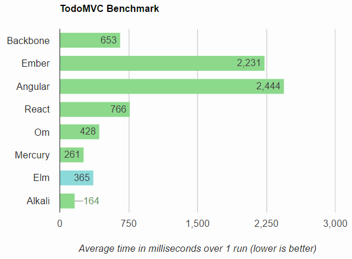

# TodoMVC Performance Comparison

This is forked from benchmark tests that were used to show the speed of Mercury and Elm. But it turns out, the reactive capabilities of Alkali perform even better.
https://github.com/evancz/todomvc-perf-comparison/

[**Run it yourself**][runner] to see how it works on your machine or in other
browsers!

Here are some sample results from running this in Chrome 35 with OSX 10.9.4 on
a Macbook Air:

[][runner]

[runner]: http://kriszyp.github.io/todomvc-perf-comparison/
